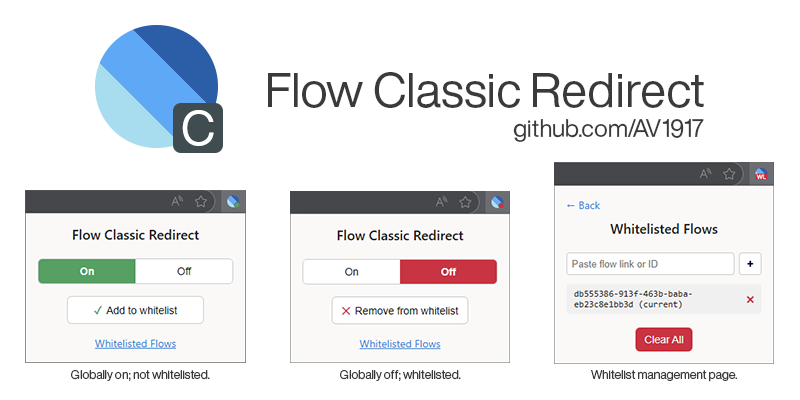

## flow-classic-redirect

A lightweight browser extension that forces Power Automate flows to open in the Classic Designer.

---

### Features
- **Automatic Redirect**: When enabled, visiting any flow URL will automatically reload the page in Classic Designer mode. If a flow has been whitelisted, it will remain in New Designer mode.
- **Global On/Off**: Toggle redirection on or off across all flows.
- **Per-Flow Whitelist**: Exclude individual flows from redirection.
- **Whitelist Manager**: View whitelisted flows; ability to remove items individually or all at once.
- **Visual Feedback**: Toolbar icon and popup controls clearly indicate the current state.

---

## Permissions

- **Host permission**: `https://make.powerautomate.com/*`
- **Storage**: Persists your global settings and whitelisted flow IDs across sessions.

---

### Installation
1. Clone or download this repository; unzip.
2. Open `chrome://extensions` (Chrome) or `edge://extensions` (Edge).
3. Enable **Developer mode**, click **Load unpacked**, and select this folder.